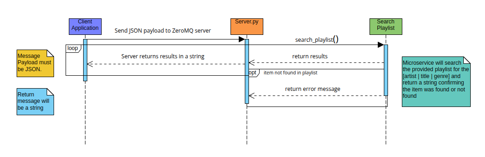

[](https://github.com/tjnorred/CS361-A/releases)

# Playlist Search

## Contents


**[Summary](#summary)**

**[Using Playlist Search](#using-playlist-search)**

* **[Installation](#installation)**
    *  [Prerequisites](#prerequisites)
    *  [Installation Steps](#installation-steps)


* **[Running Server](#running-server)**

    *  [Using the default port](#using-the-default-port)

    *  [Specifying a custom port](#specifying-a-custom-port)

**[Communication contract](#communication-contract)**

*  [Connect client to Server](#connect-client-to-server)

*  [Request Data](#request-data)

*  [Receive Data](#receive-data)

**[UML Sequence Diagram](#uml-sequence-diagram)**

**[Logging](#logging)**

**[Testing](#testing)**


## Summary

The Playlist Search Server allows clients to search for songs in a collection of playlists.  Clients send a JSON payload containing the playlists, playlist name, search category (e.g., "title", "artist", "genre"), and search term. The server searches the specified playlist and returns a string response indicating whether a match was found or not.

## Using Playlist Search
* ### Installation

    * #### Prerequisites:
        - Python 3.7+
        - ZeroMQ library (`pyzmq`)

    * #### Installation Steps:
        1) Clone the Repository: `git clone https://github.com/tjnorred/CS361-A.git`
        2) Change directory: `cd CS361-A`
        3) (Optional) Create virtual environment: `python -m venv venv`
        4) (Optional) Activate virtual environment:
        * Linux/Mac: `source venv/bin/activate` 
        * Windows: `venv\Scripts\activate`
        5) Install requirements: `pip install -r requirements.txt` or `pip install pyzmq`

* ### Running Server
    You can start the server with the default port (5555) or specify a custom port using the -p or --port argument.

    * #### Using the default port:
        ```bash
        python server.py
        ```
    * #### Specifying a custom port:
        ```bash
        python server.py -p 8080
        ```
        or

        ```bash
        python server.py --port 8080
        ```

## Communication contract

* #### Connect client to Server:
    ```
    context = zmq.Context()
    socket = context.socket(zmq.REQ)
    socket.connect("tcp://localhost:5555") # change the port number to match the server
    ```

* #### Request Data:
    ```
    # Example payload
    data = {
        "playlists": {"Running Mood": [
            {"title": "Where You Are", "artist": "John Summit", "genre": "Electronic"},
            {"title": "Summer", "artist": "Calvin Harris", "genre": "Electronic"},
            {"title": "Running Up That Hill (A Deal With God)", "artist": "Kate Bush", "genre": "Synth-Pop"}
        ]},
        "playlist_name": "Running Mood",
        "search_category": "artist",
        "search_term": "John Summit"
    }

    socket.send_json(data)
    ```

* #### Receive Data:
    ```
    socket.recv_string()
    ```

## UML Sequence Diagram



## Logging
* Logs all activities to `server.log`. 
* File contains timestamps, client IPs, received requests, sent responses, and any errors that occurred.

## Testing
* Tests are under the `/tests` directory

* Run the unit tests: `python -m unittest tests/testPlaylistSearch.py`